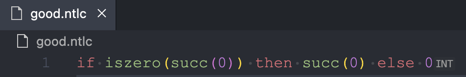
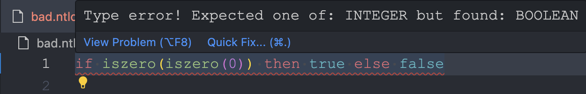

+++
title = "Language Server Protocol"
description = "The Language Server Protocol (LSP) is a protocol for enabling language features in text editors."
date = "2023-09-24"
weight = 5
+++

> Just give me the codez: [VSCode Client Side](https://github.com/abjrcode/ntlc/tree/main/lsp-extension) and [Server](https://github.com/abjrcode/ntlc/blob/main/lsp-server/src/main.rs)

# Intro

I assume you've probably worked before in an IDE environment or a "smart" editor such as VSCode, Vim, Emacs or IntelliJ just to name a few.

All of these editors provide you with smart programming language features such as syntax highlighting _(coloring)_, auto-completion, go to definition, find all references, rename symbol, etc.

Back in the day, each editor had to implement these features for each programming language. This was a lot of work and it was hard to keep up with the latest features of each language.

So, one day, a group of people got together and decided to create a protocol that would allow editors to support many languages without having to implement support for each of them over and over again for each editor.

That protocol is the [Language Server Protocol (LSP)](https://microsoft.github.io/language-server-protocol/overviews/lsp/overview/).

# Overview

The way one decouples an editor from a language is by:

1. Having a server that implements the LSP for the language
   - The server is written once using whatever language the author desires
   - The server is responsible for providing the language features. It has intimate knowledge of the language
   - The different editors can use the same server because all parties agree on the protocol
2. Each editor or IDE provides a mechanism to implement a client. Most IDEs do this by providing a plugin mechanism
   - The client is usually responsible for starting the server
   - The client is responsible for communicating with the server
   - The client is usually written per editor

## The Protocol

[LSP](https://microsoft.github.io/language-server-protocol/specifications/lsp/3.17/specification/) is a [JSON-RPC](https://www.jsonrpc.org/) based protocol:

- JSON because the messages exchanged back and forth between the client and server are formatted as JSON text
- RPC stands for [Remote Procedure Call](https://en.wikipedia.org/wiki/Remote_procedure_call) which means the client and server communicate by calling functions on each other.

The editor typically sends a request to the server, e.g. user opened a file, and the server responds with something that is appropriate for that particular message, e.g. the the server might choose to analyze the file and return a list of grammatical errors to the editor.

The protocol essentially defines all sorts of supported messages, what kind of fields each message has and other features of the protocol.

## Implementing the Protocol

Implementing the protocol, at least the server side of it, means you have to be able to parse the messages sent from the editor: basically deserializing the JSON payload and converting it to a _class_, _struct_ or whatever in-memory representation that is suitable for your language -- the one you're writing the LSP server _in_, not the one you're writing the server _for_.

The same has to happen when you're sending the response back to client - editor.

As you can imagine, this is repetitive and people don't implement it everyday because the protocol does not change much. Also, that's not really the interesting part of the server. You want to spend your time providing language features, not implementing the protocol details.

So, typically there are libraries that implement the protocol for you. You just have to provide the actual language features. For my use case and since I used Rust to implement the compiler, I decided ot use [Tower LSP](https://github.com/ebkalderon/tower-lsp) to write the server so that I can reuse part of the compiler code.

## Tower LSP

[Tower LSP](https://github.com/ebkalderon/tower-lsp) is a Rust library that implements the LSP protocol. It basically gives you an interface and you have to fill in the methods that implement the relevant language features for _your language_, NTLC in our case.

For example, if the user hovers over a variable, the editor will send a request to the server asking for the type of the variable.

Tower LSP will receive that message, validate it, deserialize it and then call the method you implemented to handle that specific request. You job is to focus on implementing the logic that retrieves the type of said variable.

### Syntax Highlighting

Syntax highlighting is something that is usually also implemented by the server, but some editors like VSCode allow you to supply your syntax highlighting rules in [another form](https://code.visualstudio.com/api/language-extensions/syntax-highlight-guide).

For NTLC, [this is implemented here](https://github.com/abjrcode/ntlc/blob/main/lsp-extension/syntaxes/ntlc.tmLanguage.json)

The reason editors offer this alternative mechanism in addition to language servers is mainly performance.
When the user opens a file, the editor can highlight _(color)_ almost instantly without having to wait for the the extension/plugin to activate the language server and for the language server to analyze the file and send the results back.

When the server does finally start and analyzes the file, it can contribute more "accurate" [semantic syntax highlighting](https://code.visualstudio.com/api/language-extensions/semantic-highlight-guide).

NTLC is very simple and so there is no need for the server to provide any "semantic" highlighting.

# The Hard Parts

Two things:

- You want the server to be super fast and have as little latency as possible: as you can imagine, when working in a project with many files _(some which might be thousands of lines)_ where you are constantly switching between them, inserting, editing and deleting text; the editor will be sending the server a message about each of those events and the server has to, in many cases, re-scan the source code, re-parse and type check it and maybe even more.
- You optimally want the server to be able to do all of that incrementally, i.e. without having to read the entire file. You can opt-in and tell VSCode to send only information about exactly what had changed in the file. This is called incremental synchronization. But that also means the server has to be able to figure out what to re-analyze. So servers need to keep state and cache intelligently.

In our implementation we do neither of those things:

1. NTLC is a small language that I used to learn all of the stuff I have been writing about in this series
2. NTLC programs are single line programs. There is barely any performance overhead
3. Implementing incremental lexing, parsing and type checking is something you have to consider when you start out. Adding them later is not easy. I did not know of them when I started and so I didn't implement them.

# Code

The code is made out of two parts:

- The client side: essentially a VSCode extension. NTLC is super simple. The only thing the extension does is start the corresponding server when the user is working on a file that has an `.ntlc` extension.
- The server side: a Rust tower-lsp server. I chose to support only two features:
  - Inlay hints: show the type of the entire program
    
  - Diagnostics: show errors (lexing, parsing or type checking errors) in the code
    

Notice that in the server implementation we reuse bits of the compiler code, namely the lexer, parser and type-checker. This is the main reason I decided to use Rust to implement the language server.

## VSCode TypeScript Client

```typescript
/* --------------------------------------------------------------------------------------------
 * Copyright (c) Microsoft Corporation. All rights reserved.
 * Licensed under the MIT License. See License.txt in the project root for license information.
 * ------------------------------------------------------------------------------------------ */

import { workspace, window } from "vscode";

import {
  Executable,
  LanguageClient,
  LanguageClientOptions,
  ServerOptions,
} from "vscode-languageclient/node";

let client: LanguageClient;

export async function activate() {
  const traceOutputChannel = window.createOutputChannel(
    "NTLC Language Server trace"
  );
  const command = process.env.SERVER_PATH || "ntlc_lsp";
  const run: Executable = {
    command,
    options: {
      env: {
        ...process.env,
        RUST_LOG: "debug",
      },
    },
  };
  const serverOptions: ServerOptions = {
    run,
    debug: run,
  };
  // If the extension is launched in debug mode then the debug server options are used
  // Otherwise the run options are used
  // Options to control the language client
  let clientOptions: LanguageClientOptions = {
    // Register the server for plain text documents
    documentSelector: [{ scheme: "file", language: "ntlc" }],
    synchronize: {
      // Notify the server about file changes to '.clientrc files contained in the workspace
      fileEvents: workspace.createFileSystemWatcher("**/.ntlc"),
    },
    traceOutputChannel,
  };

  traceOutputChannel.appendLine(
    `Starting NTLC Language Server: [${process.env.SERVER_PATH}]`
  );
  // Create the language client and start the client.
  client = new LanguageClient(
    "ntlc_lsp",
    "NTLC language server",
    serverOptions,
    clientOptions
  );
  client.start();
}

export function deactivate(): Thenable<void> | undefined {
  if (!client) {
    return undefined;
  }
  return client.stop();
}
```

## Server

```rust
/**
 * This code was adopted from example code from the tower-lsp crate.
 * https://github.com/ebkalderon/tower-lsp
 */
use dashmap::DashMap;
use ntlcc::parser::parse;
use ntlcc::type_checker::TypedTerm;
use serde::{Deserialize, Serialize};
use tower_lsp::jsonrpc::Result;
use tower_lsp::lsp_types::notification::Notification;
use tower_lsp::lsp_types::*;
use tower_lsp::{Client, LanguageServer, LspService, Server};

/**
 * There is many Rust constructs that are new in this file.
 * Ignore them. I didn't understand every bit when I started
 *
 * Essentially Rust doesn't support async/await completely on its own
 * You need a runtime and that runtime is provided by Tokio (https://tokio.rs/)
 * in this project
 *
 * TowerLSP is a Rust library that depends on Tokio
 *
 * What does it do you might ask?
 *
 * Essentially language server protocol is a client-server protocol
 * that allows you to write a language server that can be used by
 * any editor that supports the protocol
 *
 * The protocol is defined here: https://microsoft.github.io/language-server-protocol/specifications/specification-current/
 * It uses JSON RPC to exchange messages between the client and the server
 * Just like how the web uses HTTP to exchange messages between the browser and the server
 *
 * So instead of us worrying about implementing the protocol and its details
 * we can just use TowerLSP to do that for us
 *
 * TowerLSP leaves "blanks" for us to fill in.
 * Like what to do when the code editor sends us a message
 * saying the user hovered over a piece of code
 *
 * Or what to do when the code editor sends us a message
 * saying user opened a file
 *
 * You can see the list of all supported messages that the code editor can send
 * in the protocol documentation
 */

#[derive(Debug)]
struct Backend {
    // We use the client to talk back to the editor/IDE
    client: Client,

    // This is a map that maps a file path to its AST
    // We use this to get the AST of a file when the editor
    // asks us for inlay or diagnostics
    ast_map: DashMap<String, TypedTerm>,
}

#[tower_lsp::async_trait]
impl LanguageServer for Backend {
    /*
        Here we initialize the language server
        We tell the editor what features the language server supports
    */
    async fn initialize(&self, _: InitializeParams) -> Result<InitializeResult> {
        Ok(InitializeResult {
            server_info: Some(ServerInfo {
                name: "NTLC-LSP".to_string(),
                version: Some("0.0.1".to_string()),
            }),
            offset_encoding: None,
            capabilities: ServerCapabilities {
                inlay_hint_provider: Some(OneOf::Left(true)),
                text_document_sync: Some(TextDocumentSyncCapability::Kind(
                    TextDocumentSyncKind::FULL,
                )),
                workspace: Some(WorkspaceServerCapabilities {
                    workspace_folders: Some(WorkspaceFoldersServerCapabilities {
                        supported: Some(true),
                        change_notifications: Some(OneOf::Left(true)),
                    }),
                    file_operations: None,
                }),
                ..ServerCapabilities::default()
            },
        })
    }

    async fn initialized(&self, _: InitializedParams) {
        self.client
            .log_message(MessageType::INFO, "initialized!")
            .await;
    }

    async fn shutdown(&self) -> Result<()> {
        Ok(())
    }

    async fn did_open(&self, params: DidOpenTextDocumentParams) {
        self.client
            .log_message(MessageType::INFO, "file opened!")
            .await;

        self.on_change(TextDocumentItem {
            uri: params.text_document.uri,
            text: params.text_document.text,
            version: params.text_document.version,
        })
        .await
    }

    async fn did_change(&self, mut params: DidChangeTextDocumentParams) {
        self.on_change(TextDocumentItem {
            uri: params.text_document.uri,
            text: std::mem::take(&mut params.content_changes[0].text),
            version: params.text_document.version,
        })
        .await
    }

    async fn did_save(&self, _: DidSaveTextDocumentParams) {
        self.client
            .log_message(MessageType::INFO, "file saved!")
            .await;
    }

    async fn did_close(&self, _: DidCloseTextDocumentParams) {
        self.client
            .log_message(MessageType::INFO, "file closed!")
            .await;
    }

    /**
     * We are using inlay hints to show the type of our entire
     * NTLC program
     */
    async fn inlay_hint(
        &self,
        params: tower_lsp::lsp_types::InlayHintParams,
    ) -> Result<Option<Vec<InlayHint>>> {
        self.client
            .log_message(MessageType::INFO, "inlay hint")
            .await;

        let uri = &params.text_document.uri;

        if let Some(ast) = self.ast_map.get(uri.as_str()) {
            let term = [ast.value()];

            let inlay_hint_list = term
                .iter()
                .map(|v| {
                    (
                        0,
                        u32::MAX,
                        match v {
                            ntlcc::type_checker::TypedTerm::Boolean(_) => "BOOL".to_string(),
                            ntlcc::type_checker::TypedTerm::Integer(_) => "INT".to_string(),
                            ntlcc::type_checker::TypedTerm::Void => "VOID".to_string(),
                        },
                    )
                })
                .map(|item| InlayHint {
                    text_edits: None,
                    tooltip: None,
                    kind: Some(InlayHintKind::TYPE),
                    padding_left: None,
                    padding_right: None,
                    data: None,
                    position: Position {
                        line: 0,
                        character: item.1,
                    },
                    label: InlayHintLabel::LabelParts(vec![InlayHintLabelPart {
                        value: item.2,
                        tooltip: None,
                        location: Some(Location {
                            uri: params.text_document.uri.clone(),
                            range: Range {
                                start: Position::new(0, 0),
                                end: Position::new(0, u32::MAX),
                            },
                        }),
                        command: None,
                    }]),
                })
                .collect::<Vec<_>>();

            return Ok(Some(inlay_hint_list));
        }

        Ok(None)
    }

    async fn did_change_configuration(&self, _: DidChangeConfigurationParams) {
        self.client
            .log_message(MessageType::INFO, "configuration changed!")
            .await;
    }

    async fn did_change_workspace_folders(&self, _: DidChangeWorkspaceFoldersParams) {
        self.client
            .log_message(MessageType::INFO, "workspace folders changed!")
            .await;
    }

    async fn did_change_watched_files(&self, _: DidChangeWatchedFilesParams) {
        self.client
            .log_message(MessageType::INFO, "watched files have changed!")
            .await;
    }
}
#[derive(Debug, Deserialize, Serialize)]
struct InlayHintParams {
    path: String,
}

enum CustomNotification {}

impl Notification for CustomNotification {
    type Params = InlayHintParams;
    const METHOD: &'static str = "custom/notification";
}
struct TextDocumentItem {
    uri: Url,
    text: String,
    version: i32,
}

impl Backend {
    /**
     * Whenever a file is opened, changed, saved, etc by the user
     * the editor sends us a message
     *
     * We use this message to to lex, parse, and type check the program
     * and then publish the diagnostics to the editor
     *
     * We also store the AST of the program in the ast_map
     * This is a performance optimization
     *
     * We don't really need this in NTLC because our programs are small
     */
    async fn on_change(&self, params: TextDocumentItem) {
        let program_source = params.text.trim();

        let lex_result = ntlcc::lexer::scan(program_source).map_err(|e| e.to_string());

        let parse_result = lex_result.and_then(|tokens| parse(tokens).map_err(|e| e.to_string()));

        let type_checker_result = parse_result
            .and_then(|ast| ntlcc::type_checker::infer(&ast).map_err(|e| e.to_string()));

        let (ast, errors) = match type_checker_result {
            Ok(ast) => (Some(ast), vec![]),
            Err(e) => (None, vec![e]),
        };

        let diagnostics = errors
            .into_iter()
            .map(|item| {
                let start_position = Position {
                    line: 0,
                    character: 0,
                };
                let end_position = Position {
                    line: 0,
                    character: u32::MAX,
                };
                Diagnostic::new_simple(Range::new(start_position, end_position), item)
            })
            .collect();

        self.client
            .log_message(MessageType::INFO, "before publishing diagnostics")
            .await;

        self.client
            .publish_diagnostics(params.uri.clone(), diagnostics, Some(params.version))
            .await;

        if let Some(ast) = ast {
            self.ast_map.insert(params.uri.to_string(), ast);
        }
    }
}

#[tokio::main]
async fn main() {
    env_logger::init();

    let stdin = tokio::io::stdin();
    let stdout = tokio::io::stdout();

    let (service, socket) = LspService::build(|client| Backend {
        client,
        ast_map: DashMap::new(),
    })
    .finish();

    Server::new(stdin, stdout, socket).serve(service).await;
}
```
