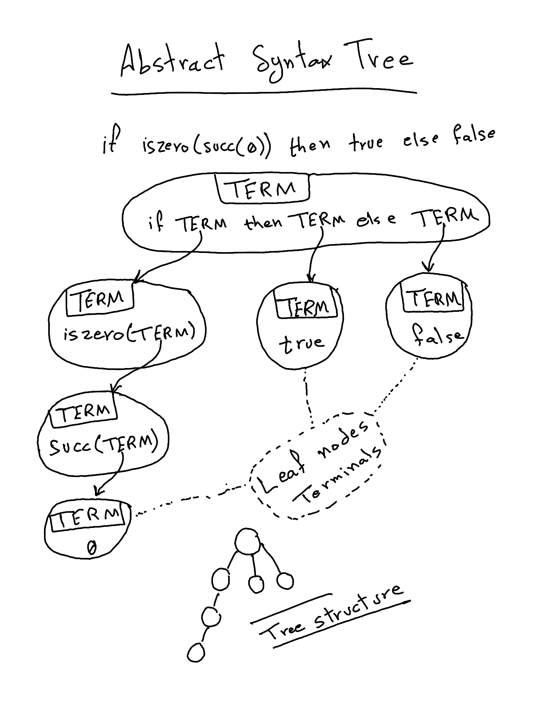

+++
title = "Parser"
description = "The parser is the second step in the compilation process. It takes the stream of tokens and converts it into an Abstract Syntax Tree (AST)."
date = "2023-09-22"
weight = 3
+++

> [Just give me the codez](https://github.com/abjrcode/ntlc/blob/main/compiler/src/parser.rs)

# Intro

Parsing -- for me -- was the most mysterious, _and to a certain extent the most scary_, part of compilers when I started.

Coming across names and acronyms like Shift-Reduce Parsers, Recursive Descent Parsers, LL(1), LR(1), LALR(1) and more made it feel like an intimidating topic.

\
But, let's take a step back and consider what a parser is and why we need one.

# Parsing

In the [previous post](@/ntlc/lexer/index.md), we talked about lexing and how it takes a stream of characters and converts it into a stream of tokens.

\
The concrete example we used was:

```ntlc
if iszero(succ(0)) then true else false
```

\
which resulted in the following list of tokens:

```rust
[
  Token::If,
  Token::IsZero,
  Token::LeftParenthesis,
  Token::Succ,
  Token::LeftParenthesis,
  Token::Zero,
  Token::RightParenthesis,
  Token::RightParenthesis,
  Token::Then,
  Token::True,
  Token::Else,
  Token::False,
]
```

\
Now, what do we want to do with these tokens?

\
Well, these tokens are a representation of our program's source code. That source code is something we want to eventually execute.

\
Now, how would we go about executing -- _evaluating_ -- this source code to get the correct result?

\
We need to somehow extract "meaning" from the source code, and the way we extract meaning is by extracting structure.

## Language and Grammar

\
The source code is written in a language, and we need to understand that language. The best solution that we "humans" came up with so far to "understand" <sup><a href="#large_language_models">1</a></sup> language was to extract structure from it, and the way we extract structure is through following a systematic grammar.

\
For example, in the case of natural languages such as English, we have a grammar rule that tells us that a sentence is composed of a subject, a verb, and an object.

\
Computer scientists adopted the same approach to allow computers to "understand" programs written in a programming language. They define grammars for said languages.

\
The parser is the machinery that carries out the task of extracting structure from source code by following the rules of the grammar.

## Theory and Practice

As far as I have seen, parsing theory which lends itself to the study of grammars and languages seems to be one of the most studied topics in compilers and computer science in general. There is so much literature and academic work on the topic<sup><a href="#parsing_theory">2</a></sup> that it is impossible to give it justice in a single blog post<sup><a href="#recommendation_grammar_book">3</a></sup>.

\
For our purposes, I am going to make a very gross simplification and say that grammar is just a bunch of substitution rules. For our language, NTLC, the grammar is:

\

```
TERM ::=
    true
    false
    if TERM then TERM else TERM
    0
    succ TERM
    pred TERM
    iszero TERM
```

How would you read this?

- Every word that is made of capital letters -- technically known as a **non-terminal** -- is something that can be replaced by what it equates to on the right-hand side.
  - In our case, we only have one non-terminal called `TERM`, and it can be replaced by any of the values on the right-hand side.
- The `::=` is just a notation for saying "can be replaced by"
- To generate a program in NTLC, you start with `TERM` and keep replacing non-terminals until you have only non-capital words left -- technically those are called **terminals**.

### Example

Following the previous grammar we can make sentences _(NTLC programs)_ such as:

- `true`: It is just a program that evaluates to `true`
- `0`: It is just a program that evaluates to `0`
- `succ(TERM)`: in this case we have one non-terminal that we still need to replace. We can choose anything that is a valid TERM. Notice that we can essentially repeat this almost indefinitely. For example, we can have `succ(succ(succ(0)))`

Another observation, the grammar allows us to construct nonsensical sentences such as:

```ntlc
succ(true)
```

Not all hope is lost though. You see, you can do the same in English with "just" the grammar:

```
The cat   is the table
^^^^^^^   ^^ ^^^^^^^
SUBJECT   VERB OBJECT
```

Evidently, this is also nonsensical.

## Semantic Analysis

The way we typically prevent such nonsensical programs is through another stage in the compiler pipeline called "Semantic Analysis". This is usually where type-checkers -- a topic we cover in the next post -- live.

\
"Semantic Analysis" is where most compiler engineers seem to spend most of their time. It is the place where the compiler _(at least in statically typed languages)_ can help the end user, developers, the most.

\
You may have seen such messages when programming:

- "You are trying to add a number to a string"
- "You are trying to call a function with the wrong number of arguments"
- "You are trying to access an undefined variable"

These and many others are the workings of the Semantic Analyzer.

\
I digress, let's get back to parsing.

# Parsing Techniques

As I said earlier, there is a lot of theory on parsing and so many techniques, but we are going to use one technique known as [**Recursive Descent Parsing**](https://en.wikipedia.org/wiki/Recursive_descent_parser).

\
Why did I choose this technique?

Honestly, it is the only kind of parsing technique that people actually implement by hand<sup><a href="#parsing_techniques">4</a></sup>. Every other technique is typically implemented by Parser Generators<sup><a href="#tree_sitter">5</a></sup>

## Recursive Descent Parsing

Recursive Descent Parsing works by following the rules of the grammar in a recursive fashion, hence the name. And it does it from top to bottom, hence the "Descent" part.

\
What does that really mean?
It is actually very simple, but, it is one of those things that seem to click only when you actually implement them.

\
Before that though, it might help if we actually see what the parser output looks like.

### Abstract Syntax Tree (AST)

Abstract Syntax Trees are so famous that people rarely refer to them by their full name. They are usually referred to as ASTs.

The reason being, my guess, is that once you have an AST representation of your source code, you can do so many things with it:

- You can evaluate it
- You can compile it to another language
- You can optimize it
- You can pretty print it

And the list goes on. They are pretty much a canonical representation of your source code.

\
So what would the AST for our NTLC program look like if it was parsed?

```ntlc
if iszero(succ(0)) then true else false
```

\
Would produce the following AST:



\
So the goal of the parser is to take the stream of tokens and convert it into such AST.

### Step by step

Let's go through an example step by step. First the grammar for reference:

```
TERM ::=
    true
    false
    if TERM then TERM else TERM
    0
    succ TERM
    pred TERM
    iszero TERM
```

and let's say we have the following source code:

```ntlc
if true then succ(0) else pred(0)
```

\
The corresponding tokens would be:

```rust
[
  Token::If,
  Token::True,
  Token::Then,
  Token::Succ,
  Token::LeftParenthesis,
  Token::Zero,
  Token::RightParenthesis,
  Token::Else,
  Token::Pred,
  Token::LeftParenthesis,
  Token::Zero,
  Token::RightParenthesis,
]
```

The way recursive descent would work on the preceding list of tokens is by following the grammar rules from top to bottom:

1. We start with `TERM`, and we see that the first token is `Token::If`, so we can use the rule `if TERM then TERM else TERM`
   - Notice that once the parser goes down this path, it kinda "remembers" that it is in the middle of parsing an `if` expression and so `then TERM else TERM` must follow. Otherwise, the parser would either have to _backtrack_ (try another possible path) or fail.
1. We see that the next token is `Token::True`, so we can use the rule `true`
1. We see that the next token is `Token::Then`, which matches our expectation so continue parsing the `if` expression.
1. We see that the next token is `Token::Succ`, so we can use the rule `succ TERM`
1. We see that the next token is `Token::LeftParenthesis`, so we can use the rule `succ (TERM)`
   - We did not mention parenthesis `(` and `)` in our grammar explicitly. They are optional and help make the code clearer in some cases.
1. We see that the next token is `Token::Zero`, so we can use the rule `0`
1. We see that the next token is `Token::RightParenthesis`, which matches our expectation.
1. We see that the next token is `Token::Else`, again, it matches our expectation.
1. Likewise, we see that the next token is `Token::Pred`, so we can use the rule `pred TERM`
1. We see that the next token is `Token::LeftParenthesis`, so we can use the rule `pred (TERM)`
1. We see that the next token is `Token::Zero`, so we can use the rule `0`
1. We see that the next token is `Token::RightParenthesis`, so we can use the rule `pred (0)`
1. Finally, we see that we have no more tokens, so we are done

### Problems and solutions

\
Now our grammar is simple, but in some cases there could be multiple possible paths (choices) that are possible and so recursive descent would have to _backtrack_ and try different alternatives.

\
I also did not mention two possible problems that could rise in different grammars:

- **Ambiguity**: There are multiple possible correct paths to parse a given input, but usually only one of them is "semantically" correct. For example, `1 + 2 * 3` could be parsed as `(1 + 2) * 3` or `1 + (2 * 3)`. The latter one is the correct one.
- **Left Recursion**: A non-terminal can be replaced by itself. Imagine if the grammar had a rule like `TERM ::= TERM + TERM`. This would result in infinite recursion. People usually solve this by rewriting the grammar rule into a "semantically equivalent" rule without the recursion on the left.

\
For a better understanding on both issues and their solutions, I refer you to [Pratt Parsers: Expression Parsing Made Easy](https://journal.stuffwithstuff.com/2011/03/19/pratt-parsers-expression-parsing-made-easy/) and [Simple but Powerful Pratt Parsing](https://matklad.github.io/2020/04/13/simple-but-powerful-pratt-parsing.html).

\
Okay, with all this talk you might think the implementation is pretty complex<sup><a href="#error_recovery">6</a></sup>, but actually it almost _rolls off the tongue_.

\
So, without further ado, I leave you with the code.

<ol id="footnotes">
  <li id="large_language_models">Recent advances in AI and specifially <a target="_blank" href="https://www.elastic.co/what-is/large-language-models">Largage Language Models (LLMs)</a> might present a different approach to understanding language. After all, many people communicate and understand others although they have never taken a single grammar class</li>
  <li id="parsing_theory">There does not seem to be much recent research on the topic though. I think it's mainly because there aren't any stones which has not been turned. i.e., it is a solved problem</li>
  <li id="recommendation_grammar_book">I highly recommend <a target="_blank" href="https://dickgrune.com/Books/PTAPG_2nd_Edition/">Parsing Techniques - A Practical Guide</a> for a very good understanding of both grammar and parsing techniques. It is an easy read even if you don't have a technical background</li>
  <li id="parsing_techniques">Funny enough, it is also the least studied theoratically. Most research covers the other techniques that are implemented by Parser Generators. Read <a target="_blank" href="https://tratt.net/laurie/blog/2020/which_parsing_approach.html">Which Parsing Approach</a> for a recap</li>
  <li id="tree_sitter"><a target="_blank" href="https://tree-sitter.github.io/tree-sitter/">Tree Sitter</a> seems to be one of the most powerful and recent Parser Generators</li>
  <li id="error_recovery">The implementation of recursive descent is simple. What turned out to be difficult when implementing parsers in general is two topics that we don't cover in this post: error recovery and error reporting, also incremental parsing</li>
</ol>

# Code

```rust
use std::iter::Peekable;

/*
 *    t ::= // terms
 *        true  // constant true
 *        false // constant false
 *        if t then t else t // conditional
 *        0 // constant zero
 *        succ t // successor
 *        pred t // predecessor
 *        iszero t // zero test
 *        */
use crate::lexer::Token;

#[derive(PartialEq)]
pub enum SyntaxError {
    UnexpectedToken { expected: Vec<Token>, found: Token },
    UnexpectedEndOfInput { expected: Vec<Token> },
}

impl std::fmt::Debug for SyntaxError {
    fn fmt(&self, f: &mut std::fmt::Formatter) -> std::fmt::Result {
        match self {
            SyntaxError::UnexpectedToken { expected, found } => {
                write!(
                    f,
                    "Unexpected '{:?}'. expected one of: {:?}",
                    found, expected
                )
            }
            SyntaxError::UnexpectedEndOfInput { expected } => {
                write!(f, "Unexpected <EOF>. expected one of: {:?}", expected)
            }
        }
    }
}

impl std::fmt::Display for SyntaxError {
    fn fmt(&self, f: &mut std::fmt::Formatter) -> std::fmt::Result {
        match self {
            SyntaxError::UnexpectedToken { expected, found } => {
                write!(
                    f,
                    "Unexpected '{:?}'. expected one of {:?}",
                    found, expected
                )
            }
            SyntaxError::UnexpectedEndOfInput { expected } => {
                write!(
                    f,
                    "Unexpected end of stream. expected one of {:?}",
                    expected
                )
            }
        }
    }
}

impl std::error::Error for SyntaxError {}

#[derive(Debug, PartialEq, Eq, Hash, Clone)]
/**
 * This is our Abstract Syntax Tree (AST)
 * It is a recursive data structure that represents the program
 * Ignore those `Box<>` for now, they are just there to make the
 * Rust borrow checker happy.
 *
 * This should be self explanatory as it literally
 * follows the structure of our grammar.
*/
pub enum Term {
    Conditional {
        condition: Box<Term>,
        consequence: Box<Term>,
        alternative: Box<Term>,
    },
    Successor(Box<Term>),
    Predecessor(Box<Term>),
    IsZero(Box<Term>),
    True,
    False,
    Zero,
    Empty,
}

impl std::fmt::Display for Term {
    fn fmt(&self, f: &mut std::fmt::Formatter) -> std::fmt::Result {
        match self {
            Term::Conditional {
                condition,
                consequence,
                alternative,
            } => write!(
                f,
                "COND[{}] -> CONSEQUENCE[{}] ;; ALT[{}]",
                condition, consequence, alternative
            ),
            Term::Successor(expr) => write!(f, "Successor[{}]", expr),
            Term::Predecessor(expr) => write!(f, "Predcessor[{}]", expr),
            Term::IsZero(expr) => write!(f, "ZeroAssertion[{}]", expr),
            Term::True => write!(f, "T"),
            Term::False => write!(f, "F"),
            Term::Zero => write!(f, "ZERO"),
            Term::Empty => write!(f, "<EMPTY>"),
        }
    }
}

fn match_left_parantheses<T>(tokens: &mut Peekable<T>) -> Result<(), SyntaxError>
where
    T: Iterator<Item = Token>,
{
    match tokens.next() {
        Some(Token::LeftParenthesis) => Ok(()),
        Some(token) => Err(SyntaxError::UnexpectedToken {
            expected: vec![Token::LeftParenthesis],
            found: token,
        }),
        None => Err(SyntaxError::UnexpectedEndOfInput {
            expected: vec![Token::LeftParenthesis],
        }),
    }
}

fn match_right_parenthesis<T>(tokens: &mut Peekable<T>) -> Result<(), SyntaxError>
where
    T: Iterator<Item = Token>,
{
    match tokens.next() {
        Some(Token::RightParenthesis) => Ok(()),
        Some(token) => Err(SyntaxError::UnexpectedToken {
            expected: vec![Token::RightParenthesis],
            found: token,
        }),
        None => Err(SyntaxError::UnexpectedEndOfInput {
            expected: vec![Token::RightParenthesis],
        }),
    }
}

fn match_then<T>(tokens: &mut Peekable<T>) -> Result<(), SyntaxError>
where
    T: Iterator<Item = Token>,
{
    match tokens.next() {
        Some(Token::Then) => Ok(()),
        Some(token) => Err(SyntaxError::UnexpectedToken {
            expected: vec![Token::Then],
            found: token,
        }),
        None => Err(SyntaxError::UnexpectedEndOfInput {
            expected: vec![Token::Then],
        }),
    }
}

fn match_else<T>(tokens: &mut Peekable<T>) -> Result<(), SyntaxError>
where
    T: Iterator<Item = Token>,
{
    match tokens.next() {
        Some(Token::Else) => Ok(()),
        Some(token) => Err(SyntaxError::UnexpectedToken {
            expected: vec![Token::Else],
            found: token,
        }),
        None => Err(SyntaxError::UnexpectedEndOfInput {
            expected: vec![Token::Else],
        }),
    }
}

/**
 * This is the recursive function that does most of the work
 * It essentially follows the structure of our grammar
 */
fn parse_term<T>(tokens: &mut Peekable<T>) -> Result<Term, SyntaxError>
where
    T: Iterator<Item = Token>,
{
    // Get the next token
    match tokens.next() {
        // If it is `true` then our AST contains a single node `Term::True`
        Some(Token::True) => Ok(Term::True),
        // If it is `false` then our AST contains a single node `Term::False`
        Some(Token::False) => Ok(Term::False),
        Some(Token::Zero) => Ok(Term::Zero),
        /*
         * If it is `iszero` then we need to check if there is a left parenthesis
         * as our grammar allows both `iszero 0` and `iszero(TERM)`
         *
         * The same applies for other builtin functions
         */
        Some(Token::IsZero) => {
            let match_right = match tokens.peek() {
                Some(&Token::LeftParenthesis) => {
                    match_left_parantheses(tokens)?;
                    true
                }
                _ => false,
            };

            /*
               This is the heart of how recursive descent works
               We call `parse_term()` again to parse the inner expression
            */
            let inner_expr = parse_term(tokens)?;

            // If we matched a left parenthesis, we need to match a right parenthesis
            if match_right {
                match_right_parenthesis(tokens)?;
            }

            Ok(Term::IsZero(Box::new(inner_expr)))
        }
        Some(Token::Succ) => {
            let match_right = match tokens.peek() {
                Some(&Token::LeftParenthesis) => {
                    match_left_parantheses(tokens)?;
                    true
                }
                _ => false,
            };

            let inner_expr = parse_term(tokens)?;

            if match_right {
                match_right_parenthesis(tokens)?;
            }

            Ok(Term::Successor(Box::new(inner_expr)))
        }
        Some(Token::Pred) => {
            let match_right = match tokens.peek() {
                Some(&Token::LeftParenthesis) => {
                    match_left_parantheses(tokens)?;
                    true
                }
                _ => false,
            };

            let inner_expr = parse_term(tokens)?;

            if match_right {
                match_right_parenthesis(tokens)?;
            }

            Ok(Term::Predecessor(Box::new(inner_expr)))
        }
        /*
           If terms might seem more complex but they follow the same
           pattern of invoking `parse_term()` recursively

        */
        Some(Token::If) => {
            let match_right = match tokens.peek() {
                Some(&Token::LeftParenthesis) => {
                    match_left_parantheses(tokens)?;
                    true
                }
                _ => false,
            };

            let condition = parse_term(tokens)?;

            if match_right {
                match_right_parenthesis(tokens)?;
            }

            match_then(tokens)?;

            let match_right = match tokens.peek() {
                Some(&Token::LeftParenthesis) => {
                    match_left_parantheses(tokens)?;
                    true
                }
                _ => false,
            };

            let consequence = parse_term(tokens)?;

            if match_right {
                match_right_parenthesis(tokens)?;
            }

            match_else(tokens)?;

            let match_right = match tokens.peek() {
                Some(&Token::LeftParenthesis) => {
                    match_left_parantheses(tokens)?;
                    true
                }
                _ => false,
            };

            let alternative = parse_term(tokens)?;

            if match_right {
                match_right_parenthesis(tokens)?;
            }

            Ok(Term::Conditional {
                condition: Box::new(condition),
                consequence: Box::new(consequence),
                alternative: Box::new(alternative),
            })
        }
        Some(Token::EOF) => Ok(Term::Empty),
        Some(token) => Err(SyntaxError::UnexpectedToken {
            expected: vec![
                Token::If,
                Token::True,
                Token::False,
                Token::Zero,
                Token::Pred,
                Token::Succ,
                Token::IsZero,
            ],
            found: token,
        }),
        None => Ok(Term::Empty),
    }
}

/**
 * Entry point of our parser
 * This is the implementation of the Recursive Descent algorithm
 *
 * It takes a vector of tokens and returns a Term (AST) or a SyntaxError
 * if the program is not valid.
 *
 * It delegates most of the work to `parse_term()` which is a recursive function
 *
 * After `parse_term()` returns, we check if there are any tokens left in the stream
 * At this stage, there must be none left otherwise the program is not valid.
 * For example, succ(0) 0 is not valid because there is a 0 at the end of the program
 */
pub fn parse(tokens: Vec<Token>) -> Result<Term, SyntaxError> {
    let mut tokens = tokens.into_iter().peekable();

    let ast = parse_term(&mut tokens)?;

    match tokens.next() {
        Some(Token::EOF) => (),
        Some(token) => {
            return Err(SyntaxError::UnexpectedToken {
                expected: vec![Token::EOF],
                found: token,
            })
        }
        None => (),
    }

    Ok(ast)
}

#[cfg(test)]
mod tests_parser_happy_path {
    use super::*;
    use crate::lexer::scan;

    #[test]
    fn test_parse_empty_program() {
        let input = "";

        let tokens = scan(input).unwrap();

        let ast = parse(tokens).unwrap();

        assert_eq!(ast, Term::Empty);
    }

    #[test]
    fn test_parse_literal_true() {
        let input = "true";

        let tokens = scan(input).unwrap();

        let ast = parse(tokens).unwrap();

        assert_eq!(ast, Term::True);
    }

    #[test]
    fn test_parse_literal_false() {
        let input = "false";

        let tokens = scan(input).unwrap();

        let ast = parse(tokens).unwrap();

        assert_eq!(ast, Term::False);
    }

    #[test]
    fn test_parse_literal_zero() {
        let input = "0";

        let tokens = scan(input).unwrap();

        let ast = parse(tokens).unwrap();

        assert_eq!(ast, Term::Zero);
    }

    #[test]
    fn test_parse_conditional() {
        let input = "if true then false else true";

        let tokens = scan(input).unwrap();

        let ast = parse(tokens).unwrap();

        assert_eq!(
            ast,
            Term::Conditional {
                condition: Box::new(Term::True),
                consequence: Box::new(Term::False),
                alternative: Box::new(Term::True),
            }
        );
    }

    #[test]
    fn test_parse_successor() {
        let input = "succ 0";

        let tokens = scan(input).unwrap();

        let ast = parse(tokens).unwrap();

        assert_eq!(ast, Term::Successor(Box::new(Term::Zero),));
    }

    #[test]
    fn test_parse_predecessor() {
        let input = "pred 0";

        let tokens = scan(input).unwrap();

        let ast = parse(tokens).unwrap();

        assert_eq!(ast, Term::Predecessor(Box::new(Term::Zero),));
    }

    #[test]
    fn test_parse_iszero() {
        let input = "iszero 0";

        let tokens = scan(input).unwrap();

        let ast = parse(tokens).unwrap();

        assert_eq!(ast, Term::IsZero(Box::new(Term::Zero),));
    }

    #[test]
    fn test_parse_nested() {
        let input = "if true then succ   (0) else pred( 0 )";

        let tokens = scan(input).unwrap();

        let ast = parse(tokens).unwrap();

        assert_eq!(
            ast,
            Term::Conditional {
                condition: Box::new(Term::True),
                consequence: Box::new(Term::Successor(Box::new(Term::Zero))),
                alternative: Box::new(Term::Predecessor(Box::new(Term::Zero)))
            }
        );
    }
}

#[cfg(test)]
mod tests_sad_path {
    use super::*;
    use crate::lexer::scan;

    #[test]
    fn test_parse_unexpected_true() {
        let input = "true true";

        let tokens = scan(input).unwrap();

        let ast = parse(tokens);

        assert_eq!(
            ast,
            Err(SyntaxError::UnexpectedToken {
                expected: vec![Token::EOF],
                found: Token::True,
            })
        );
    }

    #[test]
    fn test_parse_unexpected_false() {
        let input = "true false";

        let tokens = scan(input).unwrap();

        let ast = parse(tokens);

        assert_eq!(
            ast,
            Err(SyntaxError::UnexpectedToken {
                expected: vec![Token::EOF],
                found: Token::False,
            })
        );
    }

    #[test]
    fn test_parse_unbalanced_parenthesis() {
        let input = "iszero(true";

        let tokens = scan(input).unwrap();

        let ast = parse(tokens);

        assert_eq!(
            ast,
            Err(SyntaxError::UnexpectedToken {
                expected: vec![Token::RightParenthesis],
                found: Token::EOF,
            })
        );
    }

    #[test]
    fn test_unbalanced_if() {
        let input = "if true then false iszero 0";

        let tokens = scan(input).unwrap();

        let ast = super::parse(tokens);

        assert_eq!(
            ast,
            Err(SyntaxError::UnexpectedToken {
                expected: vec![Token::Else],
                found: Token::IsZero,
            })
        );
    }

    #[test]
    fn test_invalid_syntax_starting_with_else() {
        let input = "else 0 if true";

        let tokens = scan(input).unwrap();

        let ast = super::parse(tokens);

        assert_eq!(
            ast,
            Err(SyntaxError::UnexpectedToken {
                expected: vec![
                    Token::If,
                    Token::True,
                    Token::False,
                    Token::Zero,
                    Token::Pred,
                    Token::Succ,
                    Token::IsZero
                ],
                found: Token::Else,
            })
        );
    }

    #[test]
    fn test_parse_unexpected_token() {
        let input = "if true then false else true 0";

        let tokens = scan(input).unwrap();

        let ast = super::parse(tokens);

        assert_eq!(
            ast,
            Err(SyntaxError::UnexpectedToken {
                expected: vec![Token::EOF],
                found: Token::Zero,
            })
        );
    }
}

```
